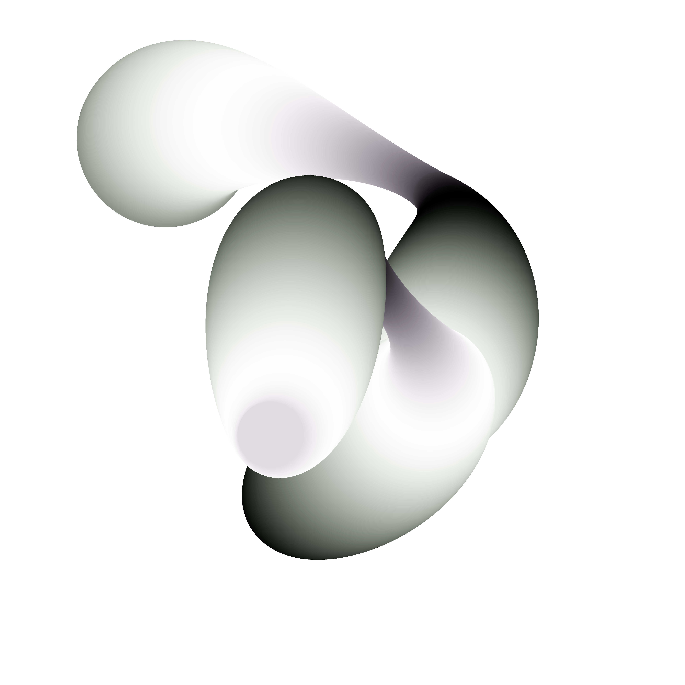
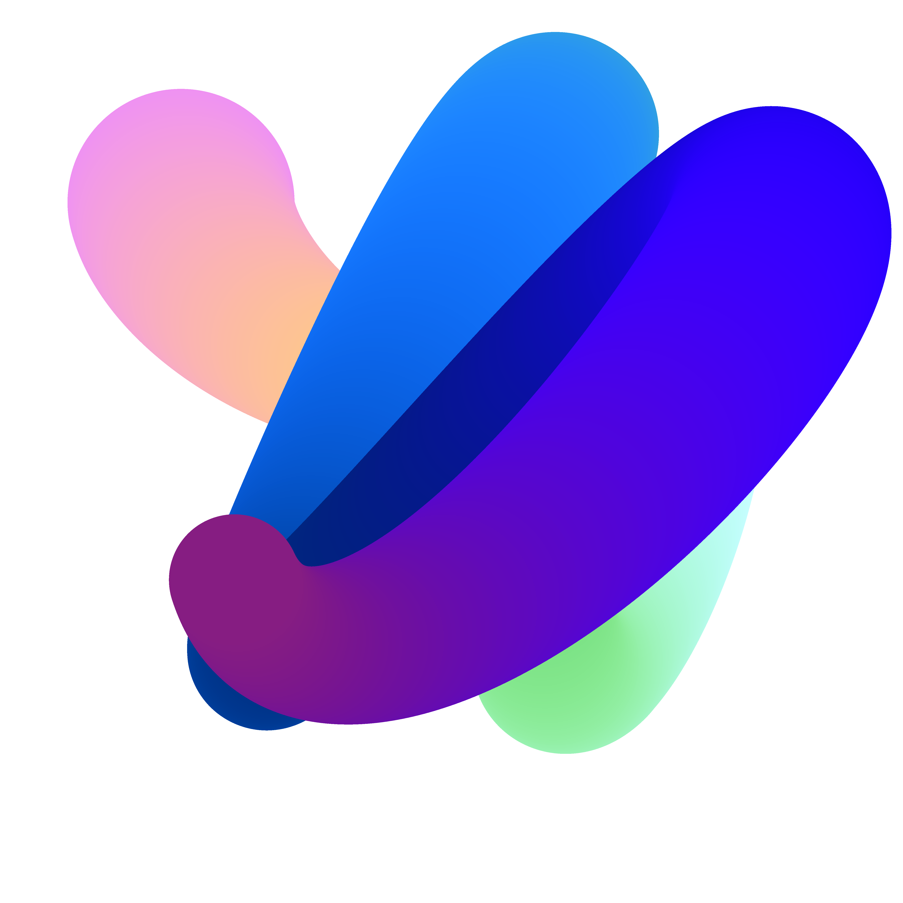
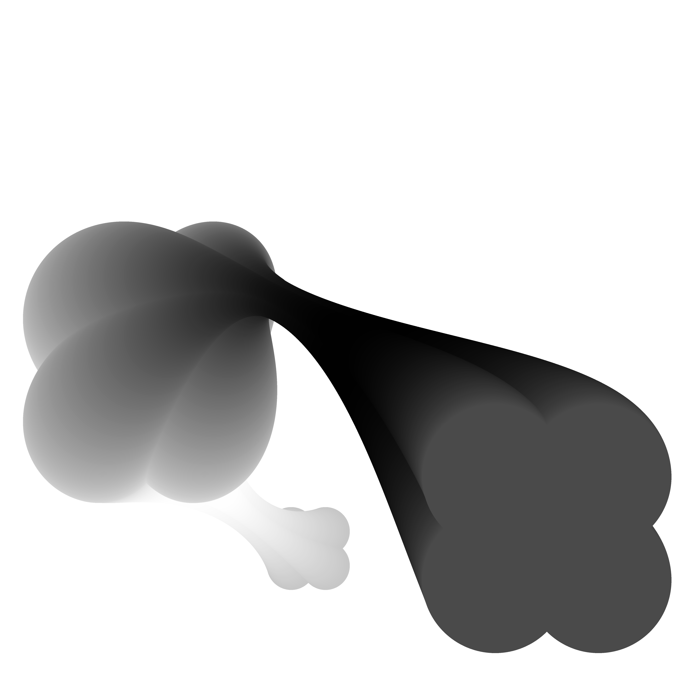
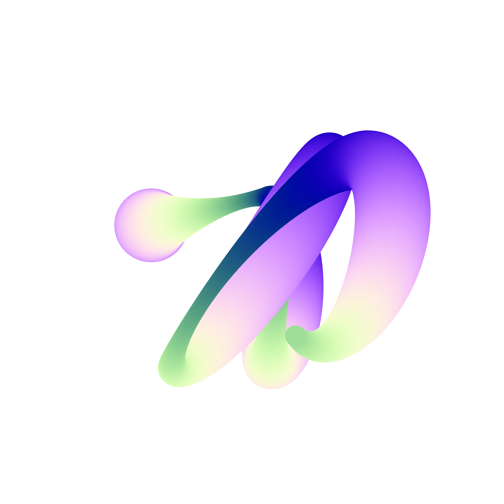

# Aalto Day One 2018 Branding Elements
This is the repository for all the openFrameworks files that were used to create the branding elements of Aalto Day One 2018. Below, there is brief documentation of the process and information about how the code works.

*Dependencies:* [openFrameworks v0.10.0](http://openframeworks.cc), [ofxCurve](https://github.com/sourya-sen/ofxCurve) (which was developed for this project)


# Description of the files and the process
**Framework** contains the boilerplate code that was written first as a platform to develop off. As the graphics being generated through generative code were to be used for large scale prints, it was important to be able to write the code in a way that the output could be scaled, yet be manageable and viewable on the computer screen. The `scale` variable controls this. While the window size is kept a constant at 1000 x 1000px, the FBO is always allocated a multiplier of the `scale` variable. The FBO is scaled to the window size to be visible on screen, but the PNG file it exports is exported at `scale * 1000 x scale * 1000` pixels. This kept the process simple as everything could be developed at a scale value of 1.0 but could be exported at any scale depending on the requirement.

After the framework was working properly, it was time to develop different ideas for the graphics.

The **projects with the dates** are the the results of these different ideas. The idea was simple (and heavily inspired by Zach Liberman's work) - generate a set of control points, draw a curve through the control points, draw circles of different sizes with different shapes based on mathematical functions through these set of points.

The following code block does this, and all the different versions are variations on the same idea.

```
//Generate a set of control points and a curve through them.
controlPoints.resize(3 * it + 1);

for(int i = 0; i<controlPoints.size(); ++i){
    controlPoints[i] = glm::vec3(ofRandom(200 * scale, width - 200 * scale), ofRandom(200 * scale, height - 200 * scale), 0.0);
}

points = evalCR(controlPoints, 200);
```

```
fbo.begin();
ofClear(0, 0);

for(int i = 0; i<points.size(); i++){

    float r = 127 + 127 * sin(ofDegToRad(i/2.0 + ofGetFrameNum()));
    float g = 127 + 127 * sin(ofDegToRad(i/2.0 + 10 * sin(ofDegToRad(ofGetFrameNum()))));
    float b = 192 + 64 * sin(ofDegToRad(i/3.0 + 45 * sin(ofDegToRad(ofGetFrameNum()))));

    ofSetColor(r, g, b);

    ofDrawCircle(points[i], (120  + (60 * sin(ofDegToRad(i + ofGetFrameNum())))) * ofNoise(ofGetFrameNum()/1000.0) * scale);
}

fbo.end();

fbo.draw(0, 0, ofGetWidth(), ofGetHeight());
```

Here are some results from this process:





Once there were a certain amount of these shapes exported, some of the shapes and some of the colour combinations were chosen as the building blocks for the visual material.

Certain frames were selected, as were some shapes, and these are the different **_shape** files. The selected frame was used in the drawing function to respect the selections.

```
int selectedFrame = 315;

for(int i = 0; i<points.size(); i++){

    float r = 127 + 127 * sin(ofDegToRad(i + selectedFrame));
    float g = 127 + 127 * sin(ofDegToRad(i + 100 * sin(ofDegToRad(selectedFrame))));
    float b = 127 + 127 * sin(ofDegToRad(i + 45 * sin(ofDegToRad(selectedFrame))));

    ofSetColor(r, g, b);

    float x = centre.x + (i/1.0) * cos(ofDegToRad(i)) * ofNoise((selectedFrame +ofGetFrameNum())/100.0) * scale;
    float y = centre.y + (i/1.0) * sin(ofDegToRad(i)) * ofNoise((selectedFrame +ofGetFrameNum())/1000.0) * scale;

    ofDrawCircle(points[i], 80 * scale + 50 * cos(ofDegToRad((i + selectedFrame +ofGetFrameNum())/1.0)) * scale);

}
```

These also needed to be animated elements as well, so image sequences were saved and later used in After Effects to create the final video files with some other, mainly text, animations. There are two sets of animations for each selection, one a basic image sequence and second, an appearance of the same. Some of the appearances do have static and animated versions, again, though. In the static versions, the shape appears without using the `ofGetFrameNum()` function and the end of the sequence lines up with the start of the main image sequence. In the animated versions, the last frame of the appearance lines up with the number of frames elapsed with the main sequence. The process of the appearance animation was simple, instead of using all the points through the curve, iterate through each point incrementally, as seen in the code example below.

```
int selectedFrame = 79;

for(int i = 0; i<counter; i++){

    float r = 127 + 127 * sin(ofDegToRad(i/2.0 + selectedFrame));
    float g = 127 + 127 * sin(ofDegToRad(i/2.0 + 10 * sin(ofDegToRad(selectedFrame))));
    float b = 192 + 64 * sin(ofDegToRad(i/3.0 + 45 * sin(ofDegToRad(selectedFrame))));

    ofSetColor(r, g, b);

    ofDrawCircle(points[i], (120  + (60 * sin(ofDegToRad(i + selectedFrame + 0.0)))) * ofNoise(selectedFrame + 0.0/1000.0) * scale);
}

fbo.end();

fbo.draw(0, 0, ofGetWidth(), ofGetHeight());

if(counter >= points.size()) ofExit();

if (counter < points.size()) counter ++;
```

**Credits**

[Anna Muchenikova](http://annamuchenikova.com/) / Art Direction

Sourya Sen, Babi Brasileiro, Robynn McPherson / Visuals and Graphics Design

Sourya Sen / Motion Graphics

Esa Kapila / Photography
